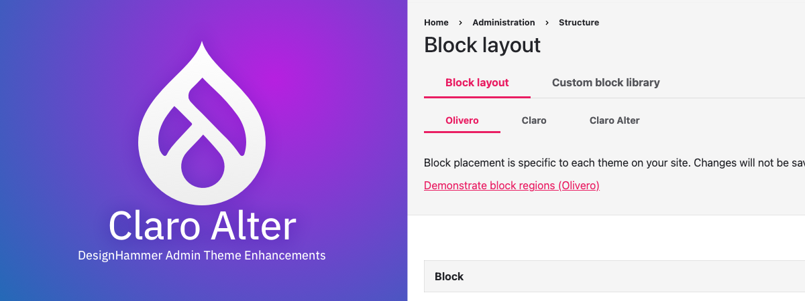

# Claro Alter - Theme

Claro Alter provides enhancements to the core Claro admin theme.

---

## Theme Styles

The Claro Alter theme is using the [jsDelivr CDN](https://www.jsdelivr.com/?docs=gh) to deliver the latest styling updates from this Github repo. To override styles per-project, uncomment this line `claroalter/claroalter-overrides`, in file `claroalter.libraries.yml`

## Highlight Color

To change the themes primary highlight color (used for links, buttons, etc.), go to the admin menu `Appearance > Settings > Claro Alter` and enter a HEX value (e.g. #abc123) in the Primary Highlight Color field under the **Primary Highlight Color Settings**.
