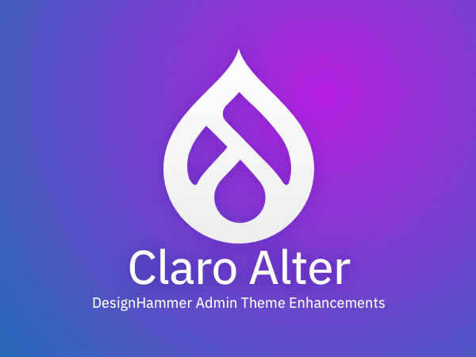

# Claro Alter - Theme



Claro Alter provides enhancements to the core Claro admin theme.

---

## CDN - jsDeliver for CSS

TODO - explan why...

- [Main CSS](https://cdn.jsdelivr.net/gh/designhammer/claroalter-drupal@0.0.1/claro_alter/css/style.css)
- [Toolbar CSS](https://cdn.jsdelivr.net/gh/designhammer/claroalter-drupal@0.0.1/claro_alter/css/toolbar.css)

Usage

```yaml
# claro_alter.libraries.yml

global-styling:
  version: VERSION
  css:
    theme:
      https://cdn.jsdelivr.net/gh/designhammer/claroalter-drupal/claro_alter/css/style.css: { type: external, crossorigin: anonymous, minified: true }
      https://cdn.jsdelivr.net/gh/designhammer/claroalter-drupal/claro_alter/css/toolbar.css: { type: external, crossorigin: anonymous, minified: true }

```
